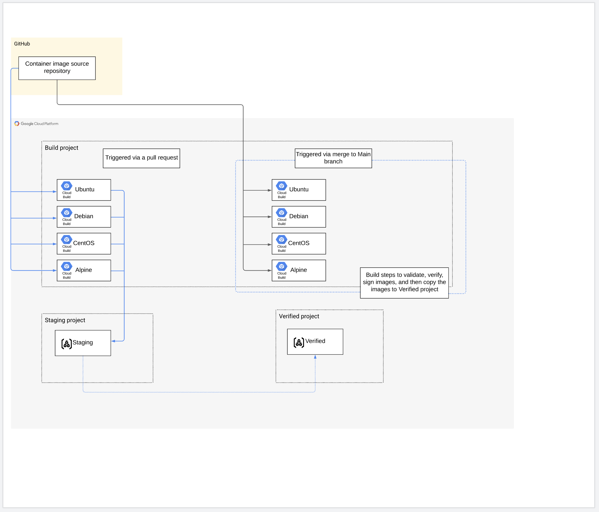

##  p-google-cicd-pipeline-work

# Table of Contents
- [Overview](#overview)
- [Build Walkthrough](#build-walkthrough)
  * [Prerequisites](#prerequisites)
    + [CLI Tools](#cli-tools)
    + [GCP Credentials](#gcp-credentials)
    + [Github Credentials](#github-credentials)
  * [Seed Project](#seed-project)
  * [Terraform Deployment](#terraform-deployment)
  * [Projects and Repos](#projects-and-repos)
  * [Link GitHub Repos to Cloud Build](#link-github-repos-to-cloud-build)
  * [Cloud Build and Automation](#cloud-build-and-automation)

# Overview

This repository contains Terraform automation code that deploys resources to Google Cloud Platform (GCP) and GitHub (GH). The resources are created for a GCP consumer to create an image build "factory." The purpose of this image build factory is to set up a framework of GCP projects, GitHub repositories, and Cloud Build configurations that are used to create and maintain a series of customized base images. The base images will be consumed in GCP as either container images or virtual machine images.

For the GCP components, the automation rolls out the following:

* Builder GCP project - pipelines, service accounts, and voucher server to support the image building and releasing
* Staging GCP project - storage for "staging" images for verification by the consumer before a release into the next stage
* Verified GCP project - storage for "verified" images, intended to be a second stage beyond staging for images
* Voucher server - deployed in Cloud Run and used by the container image pipeline to interact with the container scanning API and attest images that pass the validation
* Cloud Build Triggers - triggers on Pull Requests for the image and VM repositories (targetting the staging pipeline), and on merge to "main" (targetting the verified pipeline)

For the GitHub components, the automation rolls out the following:

* Container repository - hosts the source code for the container image builds and pipelines
* VM Image repository - hosts the source code for the VM image builds and pipelines
* Deploy keys - separate write-access deploy keys for each of the repositories



The workflow design is all source code will be in GitHub. When users want to make edits to the base images (in either the container or VM image repo), they will branch off the "Main" branch, make their changes and then issue a Pull Request when ready. When the pull request is created, the appropriate Cloud Build pipeline is triggered (based on what path file changes are detected in the branch) to build the container image(s) run any tests required (scan for vulnerabilities and attest the image if it is a container image) and then push the container image to the staging project. Once a team or team member has tested and verified that the staging image is good and working, they will approve and merge the PR, which will trigger the verified pipeline file (based on the changes detected in the branch) to copy the images to the verified project.

# Build Walkthrough

## Prerequisites

### CLI Tools
* [Google Cloud SDK](https://cloud.google.com/sdk/docs/install)

* [Terraform 0.14.10](https://releases.hashicorp.com/terraform/0.14.10/)

    Terraform 0.15.0 was recently released, but the project has not been refactored to work with 0.15.0. To install Terraform 0.14.10, run the following command. 

      TF_VERSION="0.14.10"

      wget https://releases.hashicorp.com/terraform/${TF_VERSION}/terraform_$ {TF_VERSION}_linux_amd64.zip && \
      unzip terraform_${TF_VERSION}_linux_amd64.zip && \
      mv terraform /usr/local/bin && \
      rm terraform_${TF_VERSION}_linux_amd64.zip

### GCP Credentials

The GCP account executing `./setup.sh` requires the following roles to be assigned.

- Organization Administrator
  - Grants access to set roles at the org level.
  - Prerequisite for assigning the `roles/billing.admin`  `roles/billing.user` roles.

- Billing Admin (Organization)
  - Prerequisite for assigning the role `roles/billing.user` to a service account.

### Github Credentials

The first step in the setup is a prompt asking for GitHub credentials to create the container and VM image repositories in Github.

For Terraform to create the repositories using the supplied credentials, a Personal Access Token in GitHub must be configured with *Full control of private repositories* permission.

To Create a Personal Access Token, go to ***Settings > Developer Settings > Personal Access Tokens.***

Create an environment variable on the host machine using the following command if you're using macOS or Linux.

```sh
export GITHUB_TOKEN="<PASTE_TOKEN_HERE>"
```

*NOTE: At the moment, a GitHub user account associated with an Organization is required. User org deployments are not currently supported.*

## Seed Project

Upon supplying the GitHub credentials, the setup creates the seed project, enables all APIs, and creates a service account with the following permissions:

- Browser (Folder Level)
  - Grants access to browse the hierarchy for a project, including the folder.

- Folder Viewer (Folder Level))
  - Grants the service account access to view all projects within the folder.

- Project Creator (Folder Level)
  - Grants Terraform access to create the additional projects within a folder.
  
    ***This configuration is currently set to assign the Project Creator at the org level in the main branch but was modified to allow project creation at the folder level in this branch. Review required.***

- Billing User (Org level)
  - Grants Terraform the ability to enable billing on the Build, Staging, and Verified Projects.

- Storage Object Admin (Project Level)
  - Grants Terraform access to configure the remote backend on GCS.

## Terraform Deployment

The automation is divided into two distinct Terraform plans intended to be run in sequence with a manual step in between. The first automation creates the [Projects and Repos](#projects-and-repos), and the second step deploys the [CLoud Build and Automation](#cloud-build-and-automation). The manual step between the two automation components is to [Link the Repos](#link-github-repos-to-cloud-build) to the GCP projects to install the GitHub App for Cloud Build.

At the root of the project, two folders contain all the necessary Terraform configuration in separate folders. Two separate Terraform configurations mean two separate state files will get created in separate GCS Buckets within the seed project.
```s
├─ cloud-build-and-automation
│  ├─ Cloud-build.tf
│  ├─ cloudfunctions.tf
│  ├─ container_repo
│  ├─ container_repos.tf
│  ├─ image_repo
│  ├─ image_repos.tf
│  ├─ kms.tf
│  ├─ output.tf
│  ├─ packer.tf
│  ├─ provider.tf
│  ├─ scripts
│  ├─ vars.tf
│  ├─ versions.tf
│  └─ voucher.tf
├─ project-and-repos
│  ├─ artifact_registry.tf
│  ├─ deploy_keys.tf
│  ├─ output.tf
│  ├─ project.tf
│  ├─ provider.tf
│  ├─ repos.tf
│  ├─ vars.tf
│  └─ versions.tf
└─ setup.sh
```
## Projects and Repos 

The following steps are performed when `./setup.sh` executes the `apply_projectrepos_tf` function.

  - Create projects.
  - Enable billing and APIs.
  - KMS Keyring is created.
  - Create GitHub repositories. 
  - Create and Upload two public keys, one for each repository.
  - Create an artifact registry for the staging and verified project.

## Link GitHub Repos to Cloud Build

*NOTE: If the organization already has all repos linked to CloudBuild, you can skip this step, and you can hit enter to continue setup.*

When the [Projects and Repos](#projects-and-repos) step completes, a web page will open, and you will need to authenticate to Github using your credentials. You will be redirected to a page to add the **baseimg-XXXXXX-vm** and **baseimg-XXXXXX-container** repositories. Ensure both repos are linked to Cloud Build and hit enter to continue the build.

## Cloud Build and Automation

The following steps are performed when `./setup.sh` executes the `apply_cloudbuild_tf` function.

  - Initialize Image Repo
    - Copy `./image_repo` to `/temp/baseimgfct-XXXXXX-images`
    - Download the submodule [cloud-builders-community](https://github.com/GoogleCloudPlatform/cloud-builders-community.git) into `/temp` (Packer)
    - Archive `/temp`
    - Push files
  
  - Initialize Container Repo
    - Copy `./container_repo` to `/temp/baseimgfct-XXXXXX-containers`
    - Download the submodule [voucher](https://github.com/grafeas/voucher.git) to `/temp` (Voucher Service) 
    - Archive `/temp`
    - Push files
    - Execute an initial Cloud Build run for all container images in both the Staging and Verified projects
    - The following variables are passed to the build run
      - `_VOUCHER_SERVICE_URL`
      - `_VOUCHER_SERVICE_ACCOUNT`
      - `_IMG`
      - `_SHORT_SHA`

  - Cloud Build Triggers (Builder Project)
    - All triggers are created in the builder project.
    - Triggers are executed when either a **pull request** or **merge** is made against the **main** branch. 
    - A pull request will build images in the staging project.
    - A merge will build images in the verified project.
    - When triggered, the docker files for each image are built.

  - Pub/Sub Topics (Staging Project)
    - Used to trigger the container scanning Cloud Function.
    - Executes the Cloud Function when a message is sent to the Pub/Sub topic.

  - Cloud Functions (Staging Project)
    - Cloud Function for each image in the staging project.
    - A Python function is created using the `./scripts` folder that is first zipped and uploaded to a GCS bucket. The function is then created from the zip file on the GCS bucket.
    - Used to trigger container builds based on CVE fixes found.
    - Executes a Cloud Build run to build the images with the fixes.

  - Voucher Service (Staging Project)
    - Created after dependencies are downloaded into `/temp.`
    - A voucher config is created from `./templates/config.toml.tpl`
    - Voucher is built from `/temp/tutorials/cloudrun/cloudbuild-server.yaml` using CloudBuild.
    - A Cloud Run service is created from the image built using Vouchers `cloudbuild-server.yaml.`
    - Every time a container is built in the staging project; a post request is sent to the Voucher service URL with details about the image.
    - Voucher will fail any image builds if there have critical security vulnerabilities.
    - If no critical security vulnerabilities are found, the image is passed and built.


